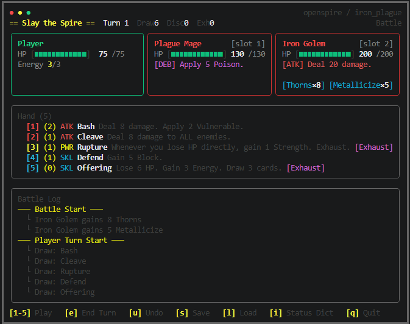

<div align="center">


**게임 개발의 새로운 패러다임**

🎮 게임 CLI화 &nbsp;•&nbsp; 🤖 AI 네이티브 &nbsp;•&nbsp; 🔌 핫플러그 규칙

<p align="center">
  <a href="README.md"><b>English</b></a>
  &nbsp;•&nbsp;
  <a href="README_zh.md">中文</a>
  &nbsp;•&nbsp;
  <a href="README_ja.md">日本語</a>
</p>

<p align="center">

[](https://www.xiaohongshu.com/user/profile/678d1c15000000000e01d5d2)
[](https://x.com/devccgame)
[](LICENSE)

</p>

</div>

---

## 이것은 무엇인가?

OpenSpire는 **범용 턴제 카드 이벤트 오케스트레이션 엔진**으로, Slay the Spire의 완전한 구현이 데모로 포함되어 있습니다.

핵심 철학: **게임 규칙과 데이터는 완전히 Lua 스크립트로 정의**되어 엔진 코드를 건드리지 않고도 핫플러그 방식으로 확장할 수 있습니다. 모든 동작은 이벤트 파이프라인을 통해 흐를며, 자연스럽게 CLI 제어와 AI 프로그래밍 제어를 지원합니다.

데이터 중심 게임의 경우, **AI가 게임 디자인과 로직 개발 주기를 극적으로 단축**할 수 있습니다. 코딩 지식이 필요 없습니다. AI는 게임 밸런스 수정도 수행하여 개발 주기를 수개월에서 수주, 심지어 그 이하로 단축할 수 있습니다.

## 왜 OpenSpire?

| 기능 | 설명 |
|------|------|
| 🎮 **게임 CLI화** | 내장 JSON/stdio 인터페이스로 모든 동작을 프로그램으로 제어 가능 |
| 🤖 **AI 네이티브 지원** | AI CLI 실행 지원, 스킬 규칙으로 새로운 게임 데이터 생성 |
| 🔌 **핫플러그 규칙** | 카드/적/상태 추가는 Lua 스크립트 추가만으로 재시작 불필요 |
| 📝 **순수 데이터 중심** | 게임 로직은 Lua에 작성, 엔진은 이벤트 오케스트레이션만 담당 |
| 🖥️ **터미널에서 플레이 가능** | 내장 Ink UI로 프론트엔드 없이 완전한 경험 가능 |

## 빠른 시작

```sh
pnpm install
pnpm start              # 인터랙티브 시나리오 선택
pnpm start iron_plague  # 특정 시나리오 직접 실행
```

### 터미널 표시



## 프로젝트 구조

```
evt/
  core/        # 엔진 코어: 이벤트 파이프라인, Lua 런타임, 상태 관리
  sts/         # STS 규칙: 카드, 적, 상태, 캐릭터 정의
  game/        # 세션 오케스트레이션, 시나리오 로딩, 표시
  bin/         # CLI 진입점 (터미널 UI + JSON 모드)
ui/            # Ink 터미널 인터페이스
scenarios/     # 전투 시나리오 JSON 설정
```

## 확장 가이드

- **카드/상태/적 추가** → [doc/en/evt/sts/SKILL.md](doc/en/evt/sts/SKILL.md) 참조
- **새로운 규칙 세트 구축** → [doc/en/evt/SKILL.md](doc/en/evt/SKILL.md) 참조

예: 새 카드 추가는 Lua 스크립트 정의만 필요

```js
export const myCard = {
  id: 'my_card',
  cost: 1,
  hooks: {
    'event:card:effect': `State.emit('entity:attack', { target = Event.target, amount = 10 })`
  }
};
```

