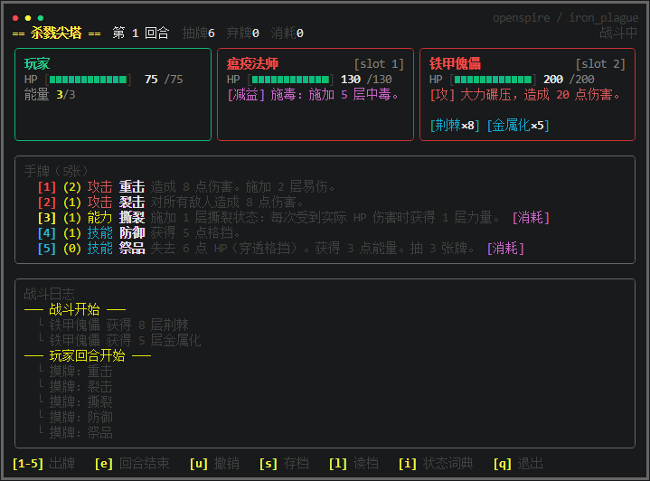

<div align="center">


**游戏开发新范式**

🎮 游戏 CLI 化 &nbsp;•&nbsp; 🤖 AI 原生友好 &nbsp;•&nbsp; 🔌 规则热插拔

<p align="center">
  <a href="README.md"><b>English</b></a>
  &nbsp;•&nbsp;
  <a href="README_ja.md">日本語</a>
  &nbsp;•&nbsp;
  <a href="README_ko.md">한국어</a>
</p>

<p align="center">

[](https://www.xiaohongshu.com/user/profile/678d1c15000000000e01d5d2)
[](https://x.com/devccgame)
[](LICENSE)

</p>


</div>


---

## 这是什么？

OpenSpire 是一个**通用回合制卡牌事件编排引擎**，内置完整的 Slay the Spire 实现作为示例。

它的核心理念是：**游戏规则与数据完全通过 Lua 脚本定义**，无需修改引擎代码，即可热插拔地构建全新玩法。所有操作通过事件管道流转，天然支持 CLI 化控制与 AI 程序化接管。

对于数据驱动型的游戏而言，可以**利用AI大大缩短游戏设计与逻辑层的开发周期**，不懂代码也没有关系，以及利用AI修复游戏平衡性，将原本需要几个月的开发周期缩短为几周甚至更少。

## 为什么选择 OpenSpire？

| 能力 | 说明 |
|------|------|
| 🎮 **游戏 CLI 化** | 内置 JSON/stdio 接口，任何操作都可程序化控制 |
| 🤖 **AI 原生友好** | 支持AI运行cli，内置skill规则生成新的游戏数据 |
| 🔌 **规则热插拔** | 新增卡牌/敌人/状态只需添加 Lua 脚本，无需重启 |
| 📝 **纯数据驱动** | 游戏逻辑写在 Lua 里，引擎只负责事件编排 |
| 🖥️ **终端即玩** | 内置 Ink 界面，无需前端即可完整体验 |

## 快速开始

```sh
pnpm install
pnpm sts                         # STS：先选语言，再选场景
pnpm sts -- iron_plague          # STS：直接启动指定场景
pnpm sts -- --lang en            # STS：跳过语言选择，直接英文进入
pnpm balatro                     # Balatro：先选语言，再开始游戏
pnpm balatro -- --lang zh        # Balatro：跳过语言选择，直接中文进入
```

### 终端展示



## 项目结构

```
evt/
  core/        # 引擎核心：事件管道、Lua 运行时、状态管理
  sts/         # STS 规则实现：卡牌、敌人、状态、角色定义
  game/        # 会话编排、场景加载、状态展示
  bin/         # CLI 入口（终端 UI + JSON 模式）
ui/            # Ink 终端界面
scenarios/     # 战斗场景 JSON 配置
```

## 扩展指南

- **添加卡牌/状态/敌人** → 见 [doc/en/evt/sts/SKILL.md](doc/en/evt/sts/SKILL.md)
- **构建全新规则集** → 见 [doc/en/evt/SKILL.md](doc/en/evt/SKILL.md)

示例：添加一张新卡只需定义 Lua 脚本

```js
export const myCard = {
  id: 'my_card',
  cost: 1,
  hooks: {
    'event:card:effect': `State.emit('entity:attack', { target = Event.target, amount = 10 })`
  }
};
```


